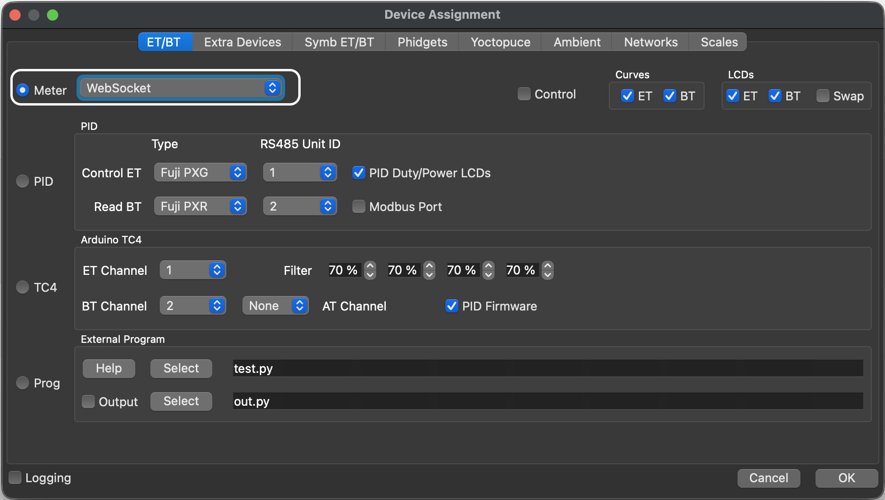
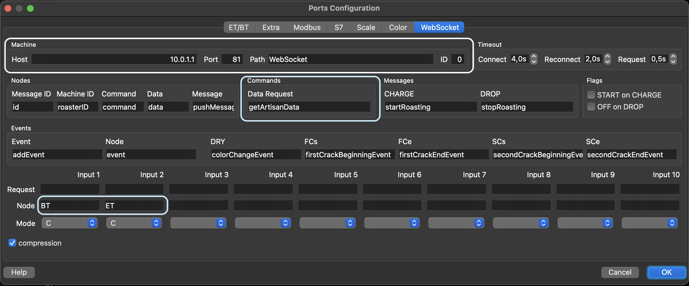
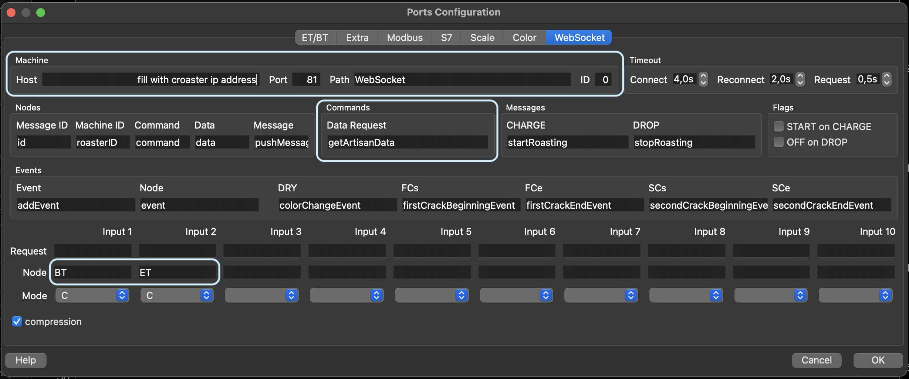

# ☕ Croaster - Open Source Coffee Roaster Monitor

> 🇮🇩 Versi Bahasa Indonesia tersedia di [README_ID.md](README_ID.md)

**Croaster** is a lightweight, open-source temperature monitoring system built on ESP-based microcontrollers. Designed for coffee roasting enthusiasts and professionals, it reads from two thermocouple sensors (Bean Temperature and Environment Temperature) and displays real-time data on a compact OLED screen. Croaster connects seamlessly to popular roasting software via WiFi (WebSocket) and BLE (on boards that support it), making it compatible with both desktop and mobile roasting apps.

**Current Firmware Version:** `0.52`

---

## 📑 Table of Contents

- [☕ Croaster - Open Source Coffee Roaster Monitor](#-croaster---open-source-coffee-roaster-monitor)
  - [📑 Table of Contents](#-table-of-contents)
  - [🚀 Features](#-features)
  - [🧩 Hardware Components](#-hardware-components)
  - [🛠 Software Architecture](#-software-architecture)
    - [Data Flow](#data-flow)
  - [📦 Libraries \& Dependencies](#-libraries--dependencies)
  - [🔧 How to Build and Upload](#-how-to-build-and-upload)
  - [📦 Using Croaster as a library in your own project](#-using-croaster-as-a-library-in-your-own-project)
  - [🔗 WiFi Setup Guide](#-wifi-setup-guide)
  - [📡 Communication Overview](#-communication-overview)
    - [WebSocket (WiFi)](#websocket-wifi)
    - [BLE](#ble)
  - [🔌 How to Connect Croaster with Artisan](#-how-to-connect-croaster-with-artisan)
    - [🖥️ Option 1: Direct Connection (Croaster as Access Point)](#️-option-1-direct-connection-croaster-as-access-point)
    - [🌐 Option 2: Same WiFi Network (Croaster joins your WiFi)](#-option-2-same-wifi-network-croaster-joins-your-wifi)
  - [⬆️ OTA (Over-The-Air) Updates](#️-ota-over-the-air-updates)
  - [🧪 Custom Commands](#-custom-commands)
    - [Built-in Commands](#built-in-commands)
    - [Adding Custom Commands](#adding-custom-commands)
  - [📘 License](#-license)
  - [❤️ Contributing](#️-contributing)
  - [🔗 Related Links](#-related-links)

---

## 🚀 Features

* Supports **ESP8266 and ESP32** based boards via per-board implementations
* Real-time monitoring of **two MAX6675 thermocouple sensors**:
  - **BT** — Bean Temperature (inside the drum)
  - **ET** — Environment Temperature (exhaust/inlet)
* **Rate of Rise (RoR)** calculation for both BT and ET, updated automatically
* Temperature unit switching: **Celsius** or **Fahrenheit**
* Configurable data send interval (default: every **3 seconds**)
* Built-in **temperature smoothing** (smoothing factor: 5) to reduce sensor noise
* Visual output on a **128×64 OLED display** (SSD1306, I2C)
* WiFi communication via **WebSocket** on port **81**, compatible with:
  + [**Artisan Roaster Scope**](https://artisan-scope.org/) — industry-standard roasting logger
  + [**ICRM app**](https://iiemb.github.io/#/icrm) — companion mobile app (Android)
* **BLE communication** (on boards that support it) for the [**ICRM app**](https://iiemb.github.io/#/icrm)
* **OTA (Over-The-Air) firmware updates** via WebSocket (WiFi) and **BLE** (on boards that support it)
* **WiFiManager** captive portal for easy WiFi credential setup — no re-flashing needed
* Unique device naming based on chip ID (e.g. `Croaster-A1B2`)
* **Dummy mode** for development and testing without physical sensors
* Custom JSON command system via the centralized `CroasterCommandHandler` class
* Easily extendable with user-defined commands

---

## 🧩 Hardware Components

| Component | Description |
|:---|:---|
| 1× ESP-based microcontroller (WiFi and/or BLE) | Main microcontroller — see `implementation/<board>/README.md` for the supported boards |
| 1× [128×64 OLED display (SSD1306, I2C)](images/OLED-Display.png) | Real-time temperature display |
| 2× [MAX6675 thermocouple modules](images/MAX6675.png) | SPI-based K-type thermocouple ADC |
| 2× [K-type thermocouple probes](images/Type-K-thermocouple.png) | Temperature probes (BT & ET) |

> All components run on **3.3V**. Ensure your power supply can handle the combined current draw of both sensors and the display.

> 🔌 **Wiring diagrams are per board** — see `implementation/<board>/README.md`.

---

## 🛠 Software Architecture

Croaster uses a clean, **modular C++ architecture** built with the Arduino framework. Each subsystem is encapsulated in its own class.

The repository is structured as a **reusable library** (repo root: `src/` + `library.json`) plus per-board **implementations** in `implementation/<board>/`. The library is **display- and pin-config-agnostic** — each implementation supplies its own display, pin layout, LED and dummy-mode configuration.

### Library modules (repo root `src/`)

| Module | File | Responsibility |
|:---|:---|:---|
| `CroasterCore` | `src/CroasterCore.h/.cpp` | Sensor reading, RoR calculation, temperature smoothing, data state |
| `CroasterDisplay` | `src/CroasterDisplay.h` | **Abstract display interface** — implemented by the consuming project |
| `CroasterPinConfig` | `src/CroasterPinConfig.h` | Thermocouple pin layout (passed to `CroasterCore`) |
| `CroasterCommandHandler` | `src/CroasterCommandHandler.h/.cpp` | JSON command parsing and dispatching (BLE & WebSocket) |
| `CroasterWebSocketManager` | `src/CroasterWebSocketManager.h/.cpp` | WebSocket server, data broadcast, OTA trigger |
| `CroasterBleManager` | `src/CroasterBleManager.h/.cpp` | BLE server, characteristic notify, command receive *(only compiled when the board has BLE)* |
| `CroasterOtaHandler` | `src/CroasterOtaHandler.h/.cpp` | Binary OTA update handling over WebSocket and BLE |
| `CroasterWiFiManager` | `src/CroasterWiFiManager.h/.cpp` | WiFiManager captive portal setup and lifecycle |
| `CroasterDeviceIdentity` | `src/CroasterDeviceIdentity.h/.cpp` | Chip ID, device name, IP address helpers |
| `CroasterApp` | `src/CroasterApp.h/.cpp` | **Single `begin()`/`loop()` entry point** — display-agnostic; takes `CroasterCore&` + `CroasterDisplay*` (+ LED pin/level) |

### Implementation modules (`implementation/`)

Shared components and per-board projects live under `implementation/`:

| Path | Purpose |
|:---|:---|
| `implementation/common/` | Shared SSD1306 display + animation (`CroasterDisplaySSD1306`, `CroasterDisplayAnimation`) used by the OLED-based boards |
| `implementation/<board>/` | Per-board project: `platformio.ini`, `main.cpp`, `config.h`, plus a `README.md` documenting that board (wiring, build flags, partitions) |

Each board folder is a standalone PlatformIO project (`main.cpp` + `config.h`) that consumes the Croaster library (`../..`) and any shared components (`../common`), then wires them into the library's display-agnostic `CroasterApp`.

### Data Flow

```
MAX6675 Sensors → CroasterCore (read + smooth + RoR)
                       ↓
          ┌────────────┴────────────┐
  CroasterWebSocketManager  CroasterBleManager (boards with BLE)
          ↓                         ↓
   Artisan / ICRM              ICRM (Android)
```

---

## 📦 Libraries & Dependencies

| Library | Purpose |
|:---|:---|
| [arduinoWebSockets](https://github.com/Links2004/arduinoWebSockets) | WebSocket server |
| [ArduinoJson](https://arduinojson.org/) `^7.4.3` | JSON command parsing and serialization |
| [Adafruit SSD1306](https://github.com/adafruit/Adafruit_SSD1306) `^2.5.16` | OLED display driver |
| [MAX6675_Thermocouple](https://github.com/YuriiSalimov/MAX6675_Thermocouple) `^2.0.2` | Thermocouple sensor reading |
| [WiFiManager](https://github.com/tzapu/WiFiManager) `^2.0.17` | Captive portal WiFi setup |
| ESP32 BLE Arduino *(built-in ESP32 core)* | BLE server & characteristics |

---

## 🔧 How to Build and Upload

> PlatformIO is the only supported workflow (Arduino IDE is not used).

The repository root is a **reusable library**. Each supported board has its own
implementation folder — pick it and build/upload from there:

1. Install [PlatformIO](https://platformio.org/) (VS Code extension or CLI)
2. Clone the repository and enter your board's implementation folder:

   ```bash
   git clone git@github.com:IiemB/Croaster.git
   cd Croaster/implementation/<board>
   ```

3. Review `platformio.ini` and select your target environment
4. Upload the firmware:

   ```bash
   pio run -t upload
   ```

Each board's `README.md` documents its own build command, wiring and any special
build flags (e.g. custom partition tables).

---

## 📦 Using Croaster as a library in your own project

The repository root is a standard PlatformIO library. Add it to another
project's `platformio.ini`:

```ini
[env:your_board]
lib_deps =
    https://github.com/IiemB/Croaster.git
```

The easiest way to start is to copy an implementation
(`implementation/<board>/`) and adapt it. It exposes a single `begin()`/`loop()`
API via `CroasterApp`, and all board-specific config (pins, dummy mode, LED,
display) lives in the implementation — not the library:

```cpp
#include <Arduino.h>
#include <ArduinoJson.h>
#include "config.h"                 // pins, dummyMode, ledPin/ledOnLevel (edit here)
#include "CroasterDisplaySSD1306.h" // or your own CroasterDisplay subclass
#include "CroasterApp.h"

CroasterCore core(dummyMode, pins);
CroasterDisplaySSD1306 display(core);     // display defined in the implementation
CroasterApp app(core, &display, ledPin, ledOnLevel);

void setup() { app.begin(); }
void loop()  { app.loop(); }
```

Or wire it yourself (see `CroasterApp.cpp` for the full wiring):

```cpp
#include <CroasterCore.h>
#include <CroasterPinConfig.h>
#include <CroasterCommandHandler.h>
#include <CroasterWebSocketManager.h>
#include <CroasterBleManager.h>
#include <CroasterWiFiManager.h>

CroasterPinConfig myPins = { /* sckPin, soPin, csPinBt, csPinEt */ };

CroasterCore croaster(false, myPins);   // your pin layout
MyDisplay display(croaster);            // your CroasterDisplay subclass
CroasterCommandHandler commands(croaster, &display);
CroasterWebSocketManager ws(croaster, commands, &display);

#if CROASTER_HAS_BLE  // auto-detected: 1 on ESP32, 0 otherwise
CroasterBleManager ble(croaster, commands, &display);
#endif
```

- **Display** — implement `CroasterDisplay` (`begin`, `loop`, `rotateScreen`,
  `blinkIndicator`, `displayToggle`, and the OTA-progress methods). Pass
  `nullptr` where the board has no display.
- **Pins, dummy mode & LED** — build your own `CroasterPinConfig` and pass it
  to `CroasterCore`; choose `dummyMode`, `ledPin`/`ledOnLevel` in the
  implementation's `config.h`.
- **BLE** — the library detects BLE support at compile time via
  `CROASTER_HAS_BLE` (1 on ESP32, 0 elsewhere) and only compiles
  `CroasterBleManager` when available.
- **Custom commands** — add commands without touching the library:
  `app.commands().onCommand("ping", ...)` for string commands and
  `app.commands().onJsonCommand("myKey", ...)` for nested JSON commands.

---

## 🔗 WiFi Setup Guide

Croaster uses **WiFiManager** to handle WiFi credentials without re-flashing. On first boot (or after erasing credentials), Croaster creates its own access point:

1. On your phone or computer, connect to the WiFi network named `[XXXX] Croaster-XXXX`
2. A captive portal will open automatically — enter your home WiFi SSID and password
3. Croaster will save the credentials and connect automatically on subsequent boots
4. The IP address assigned to Croaster is shown on the OLED display

For a visual walkthrough, see: ➡️ [How to Connect to WiFi - YouTube](https://www.youtube.com/watch?v=esNiudoCEcU&t=434s)

---

## 📡 Communication Overview

### WebSocket (WiFi)

- **Port:** `81`
- **Protocol:** WebSocket (text frames for JSON commands, binary frames for OTA)
- **Data format:** JSON, broadcast every `intervalSend` seconds (default: 3s)
- Compatible with **Artisan Roaster Scope** and **ICRM app** (Android)

### BLE

- **Service UUID:** `1cc9b045-a6e9-4bd5-b874-07d4f2d57843`
- **Data Characteristic UUID:** `d56d0059-ad65-43f3-b971-431d48f89a69`
- Supports notify (data push) and write (command receive)
- Available on boards that support BLE (e.g. ESP32) — compatible with the **ICRM app** (Android)

---

## 🔌 How to Connect Croaster with Artisan

You can connect your Croaster device to Artisan using either a direct WiFi connection or through your home/local WiFi network.

1. Open Artisan → **Config → Device**
2. Select **Meter → WebSocket**
   
   

### 🖥️ Option 1: Direct Connection (Croaster as Access Point)

Use this method when Croaster is **not** connected to any WiFi network, or when you want a direct peer-to-peer connection.

1. On your computer, connect to the WiFi network broadcasted by Croaster (e.g. `[XXXX] Croaster-XXXX`)
2. Open Artisan → **Config → Port**
3. Set the configuration as shown below:

   

### 🌐 Option 2: Same WiFi Network (Croaster joins your WiFi)

Use this method when Croaster is already connected to your home/office WiFi network.

1. Make sure your laptop and Croaster are on the **same WiFi network**
2. Open Artisan → **Config → Port**
3. Enter the **IP address** shown on the Croaster OLED display (or via serial monitor)
4. Set the configuration as shown:

   

---

## ⬆️ OTA (Over-The-Air) Updates

Croaster supports firmware updates without a USB cable, via the **ICRM app** over WebSocket (WiFi) or BLE (on boards that support it).

- OTA is handled by the `CroasterOtaHandler` class, which receives binary firmware data in chunks and returns a JSON progress payload after each chunk
- Progress is shown on the OLED display during the update
- BLE OTA includes timeout checks to handle stalled transfers
- Some boards need a partition table with an OTA slot — see the board's `README.md`
- After a successful OTA update, Croaster restarts automatically

---

## 🧪 Custom Commands

Croaster accepts JSON-formatted commands over both WebSocket and BLE. The `CroasterCommandHandler` class dispatches all incoming commands.

### Built-in Commands

All commands use the `"command"` key. Basic (string) commands:

| Command JSON | Action |
|:---|:---|
| `{"command": "restartesp"}` | Restarts the device |
| `{"command": "erase"}` | Erases WiFi credentials and restarts |
| `{"command": "displayToggle"}` | Toggles the OLED display on/off |
| `{"command": "rotateScreen"}` | Rotates the OLED screen 180° |
| `{"command": "dummyOn"}` | Enables dummy/test mode (no real sensors needed) |
| `{"command": "dummyOff"}` | Disables dummy mode |
| `{"command": "blink"}` | Blinks the built-in LED |
| `{"command": "getDeviceInfo"}` | Returns device info (IP, SSID, firmware version) |
| `{"command": "getExtra"}` | Returns extra user-defined data |

Configuration commands use a **nested JSON object** under `"command"`:

| Command JSON | Action |
|:---|:---|
| `{"command": {"tempUnit": "F"}}` | Switches temperature unit to Fahrenheit |
| `{"command": {"tempUnit": "C"}}` | Switches temperature unit to Celsius |
| `{"command": {"interval": 5}}` | Sets data send interval to 5 seconds |
| `{"command": {"correctionBt": 1.5, "correctionEt": -0.5}}` | Applies temperature correction offset |
| `{"command": {"wifiConnect": {"ssid": "MyWiFi", "pass": "password"}}}` | Connects to a specified WiFi network |

### Adding Custom Commands

Custom commands are registered in your implementation's `main.cpp` — **no library
edits needed**:

```cpp
app.commands().onCommand("ping", [](const JsonObject &json) -> String { ... });
app.commands().onJsonCommand("myKey", [](const JsonObject &json) -> String { ... });
```

`onCommand` handles basic string commands (`{"command":"ping"}`); `onJsonCommand`
handles nested JSON keys (`{"command":{"myKey":...}}`). Each callback returns a
response string (empty = no response). Both are available over WebSocket and BLE.

---

## 📘 License

[MIT License](LICENSE.md) — free for personal and commercial use. Contributions welcome!

---

## ❤️ Contributing

Pull requests, bug reports, and feature requests are welcome! Feel free to open an issue or submit a PR on [GitHub](https://github.com/IiemB/Croaster).

---

## 🔗 Related Links

- [ICRM App](https://iiemb.github.io/#/icrm) — companion Android app for Croaster
- [Artisan Roaster Scope](https://artisan-scope.org/) — open-source coffee roasting logger
- [WiFi Setup Video](https://www.youtube.com/watch?v=esNiudoCEcU&t=434s) — quick visual guide
- [FAQ](FAQ.md) — frequently asked questions
