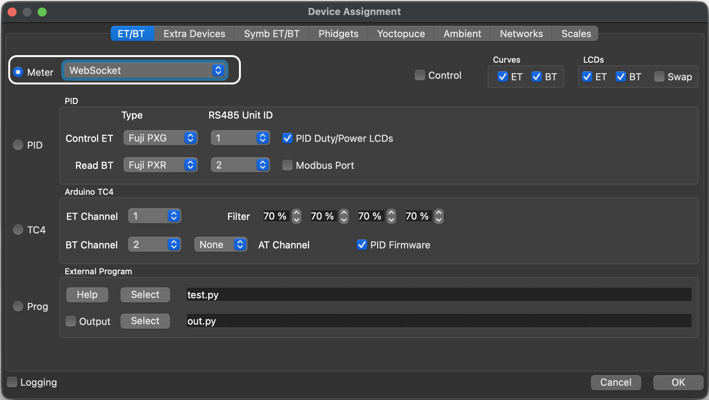
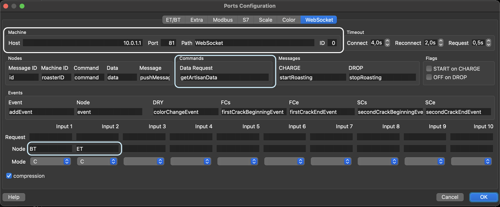
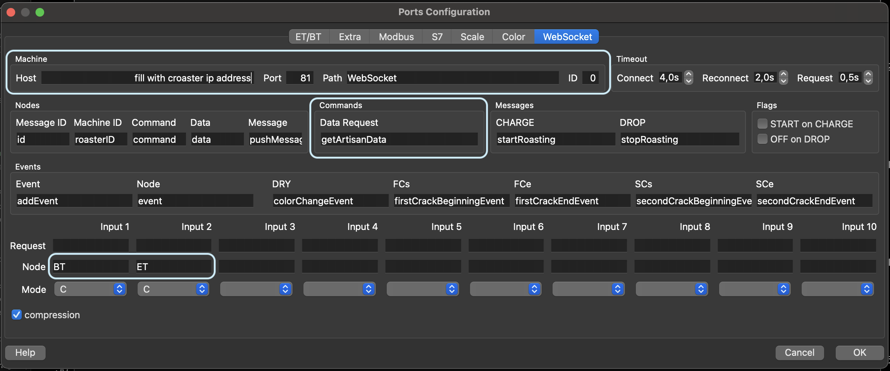

# ☕ Croaster - Monitor Sangrai Kopi Open Source

> 🇬🇧 English version available at [README.md](README.md)

**Croaster** adalah sistem pemantau suhu ringan dan open-source yang dibangun di atas mikrokontroler berbasis ESP. Dirancang untuk para pecinta dan profesional sangrai kopi, sistem ini membaca dua sensor termokopel (Suhu Biji dan Suhu Lingkungan) dan menampilkan data secara real-time di layar OLED yang ringkas. Croaster terhubung mulus ke perangkat lunak sangrai populer melalui WiFi (WebSocket) dan BLE (khusus ESP32), sehingga kompatibel dengan aplikasi sangrai di desktop maupun ponsel.

**Versi Firmware Saat Ini:** `0.51`

---

## 📑 Daftar Isi

- [☕ Croaster - Monitor Sangrai Kopi Open Source](#-croaster---monitor-sangrai-kopi-open-source)
  - [📑 Daftar Isi](#-daftar-isi)
  - [🚀 Fitur](#-fitur)
  - [🧩 Komponen Hardware](#-komponen-hardware)
  - [🔌 Diagram Pengkabelan](#-diagram-pengkabelan)
  - [🛠 Arsitektur Software](#-arsitektur-software)
    - [Alur Data](#alur-data)
  - [📦 Library \& Dependensi](#-library--dependensi)
  - [🔧 Cara Build dan Upload](#-cara-build-dan-upload)
    - [✅ PlatformIO (direkomendasikan untuk ESP8266 \& ESP32C3)](#-platformio-direkomendasikan-untuk-esp8266--esp32c3)
    - [✅ Arduino IDE (alternatif, diperlukan untuk board Makergo ESP32C3)](#-arduino-ide-alternatif-diperlukan-untuk-board-makergo-esp32c3)
  - [🔗 Panduan Setup WiFi](#-panduan-setup-wifi)
  - [📡 Gambaran Komunikasi](#-gambaran-komunikasi)
    - [WebSocket (WiFi)](#websocket-wifi)
    - [BLE (khusus ESP32)](#ble-khusus-esp32)
  - [🔌 Cara Menghubungkan Croaster dengan Artisan](#-cara-menghubungkan-croaster-dengan-artisan)
    - [🖥️ Opsi 1: Koneksi Langsung (Croaster sebagai Access Point)](#️-opsi-1-koneksi-langsung-croaster-sebagai-access-point)
    - [🌐 Opsi 2: Jaringan WiFi yang Sama (Croaster bergabung ke WiFi Anda)](#-opsi-2-jaringan-wifi-yang-sama-croaster-bergabung-ke-wifi-anda)
  - [⬆️ Update OTA (Over-The-Air)](#️-update-ota-over-the-air)
  - [🧪 Perintah Kustom](#-perintah-kustom)
    - [Perintah Bawaan](#perintah-bawaan)
    - [Menambahkan Perintah Kustom](#menambahkan-perintah-kustom)
  - [📘 Lisensi](#-lisensi)
  - [❤️ Kontribusi](#️-kontribusi)
  - [🔗 Tautan Terkait](#-tautan-terkait)

---

## 🚀 Fitur

* Mendukung **NodeMCU ESP8266** (hanya WiFi)
* Mendukung **ESP32C3 Super Mini** (WiFi & BLE)
* Pemantauan real-time dua sensor termokopel **MAX6675**:
  - **BT** — Bean Temperature / Suhu Biji (di dalam drum)
  - **ET** — Environment Temperature / Suhu Lingkungan (exhaust/inlet)
* Kalkulasi **Rate of Rise (RoR)** untuk BT dan ET, diperbarui otomatis
* Pergantian satuan suhu: **Celsius** atau **Fahrenheit**
* Interval pengiriman data yang dapat dikonfigurasi (default: setiap **3 detik**)
* **Penghalusan suhu** bawaan (faktor penghalusan: 5) untuk mengurangi noise sensor
* Tampilan visual di **layar OLED 128×64** (SSD1306, I2C)
* Komunikasi WiFi via **WebSocket** di port **81**, kompatibel dengan:
  + [**Artisan Roaster Scope**](https://artisan-scope.org/) — logger sangrai standar industri
  + [**Aplikasi ICRM**](https://iiemb.github.io/#/icrm) — aplikasi pendamping mobile (Android)
* **Komunikasi BLE** (khusus ESP32) untuk [**aplikasi ICRM**](https://iiemb.github.io/#/icrm)
* **Update firmware OTA (Over-The-Air)** via WebSocket (WiFi) dan **BLE** (khusus ESP32)
* **Captive portal WiFiManager** untuk setup WiFi yang mudah — tanpa perlu flash ulang
* Penamaan perangkat unik berdasarkan chip ID (contoh: `Croaster-A1B2`)
* **Mode dummy** untuk pengembangan dan pengujian tanpa sensor fisik
* Sistem perintah JSON kustom melalui kelas `CommandHandler` yang terpusat
* Mudah diperluas dengan perintah buatan pengguna

---

## 🧩 Komponen Hardware

| Komponen | Keterangan |
|:---|:---|
| 1× [NodeMCU ESP8266](images/NodeMCU-ESP8266.png) **atau** [ESP32C3 Super Mini](images/ESP32C3-Super-Mini.png) | Mikrokontroler utama |
| 1× [Layar OLED 128×64 (SSD1306, I2C)](images/OLED-Display.png) | Tampilan suhu real-time |
| 2× [Modul termokopel MAX6675](images/MAX6675.png) | ADC termokopel K-type berbasis SPI |
| 2× [Probe termokopel K-type](images/Type-K-thermocouple.png) | Probe suhu (BT & ET) |

> Semua komponen beroperasi pada **3.3V**. Pastikan catu daya Anda dapat menangani total konsumsi arus dari kedua sensor dan layar.

---

## 🔌 Diagram Pengkabelan

|  |**NodeMCU ESP8266**|**ESP32C3 Super Mini**|
|:---|:---:|:---:|
|**Layar OLED**|GND → **GND**|GND → **GND**|
| |VCC → **3.3V**|VCC → **3.3V**|
| |SCL → **D1**|SCL → **GPIO9**|
| |SDA → **D2**|SDA → **GPIO8**|
|||⠀|
|**Sensor ET** (Suhu Lingkungan)|GND → **GND**|GND → **GND**|
| |VCC → **3.3V**|VCC → **3.3V**|
| |SCK → **D5**|SCK → **GPIO4**|
| |SO  → **D7**|SO  → **GPIO5**|
| |CS  → **D6**|CS  → **GPIO6**|
|||⠀|
|**Sensor BT** (Suhu Biji)|GND → **GND**|GND → **GND**|
| |VCC → **3.3V**|VCC → **3.3V**|
| |SCK → **D5**|SCK → **GPIO4**|
| |SO  → **D7**|SO  → **GPIO5**|
| |CS  → **D8**|CS  → **GPIO7**|

> Kedua sensor berbagi jalur **SCK** dan **SO** (bus SPI). Keduanya dibedakan oleh pin **CS** masing-masing.

---

## 🛠 Arsitektur Software

Croaster menggunakan **arsitektur C++ modular** yang bersih, dibangun dengan framework Arduino. Setiap subsistem dikemas dalam kelasnya sendiri:

| Modul | File | Tanggung Jawab |
|:---|:---|:---|
| `CroasterCore` | `CroasterCore.h/.cpp` | Pembacaan sensor, kalkulasi RoR, penghalusan suhu, state data |
| `DisplayManager` | `DisplayManager.h/.cpp` | Loop rendering OLED, layar status |
| `CommandHandler` | `CommandHandler.h/.cpp` | Parsing dan dispatching perintah JSON (BLE & WebSocket) |
| `WebSocketManager` | `WebSocketManager.h/.cpp` | Server WebSocket, broadcast data, trigger OTA |
| `BleManager` | `BleManager.h/.cpp` | Server BLE, notify karakteristik, penerimaan perintah *(khusus ESP32)* |
| `OtaHandler` | `OtaHandler.h/.cpp` | Penanganan update OTA biner via WebSocket dan BLE |
| `WiFiManagerUtil` | `WiFiManagerUtil.h/.cpp` | Setup dan lifecycle captive portal WiFiManager |
| `DeviceIdentity` | `DeviceIdentity.h/.cpp` | Helper chip ID, nama perangkat, alamat IP |

### Alur Data

```
Sensor MAX6675 → CroasterCore (baca + halus + RoR)
                       ↓
          ┌────────────┴────────────┐
    WebSocketManager           BleManager (ESP32)
          ↓                         ↓
   Artisan / ICRM              ICRM (Android)
```

---

## 📦 Library & Dependensi

| Library | Kegunaan |
|:---|:---|
| [arduinoWebSockets](https://github.com/Links2004/arduinoWebSockets) | Server WebSocket |
| [ArduinoJson](https://arduinojson.org/) `^7.4.3` | Parsing dan serialisasi perintah JSON |
| [Adafruit SSD1306](https://github.com/adafruit/Adafruit_SSD1306) `^2.5.16` | Driver layar OLED |
| [MAX6675_Thermocouple](https://github.com/YuriiSalimov/MAX6675_Thermocouple) `^2.0.2` | Pembacaan sensor termokopel |
| [WiFiManager](https://github.com/tzapu/WiFiManager) `^2.0.17` | Setup WiFi via captive portal |
| ESP32 BLE Arduino *(bawaan inti ESP32)* | Server BLE & karakteristik |

---

## 🔧 Cara Build dan Upload

### ✅ PlatformIO (direkomendasikan untuk ESP8266 & ESP32C3)

1. Install [PlatformIO](https://platformio.org/) (ekstensi VS Code atau CLI)
2. Clone repositori:

   ```bash
   git clone git@github.com:IiemB/Croaster.git
   cd Croaster
   ```

3. Periksa `platformio.ini` dan pilih environment target Anda
4. Upload firmware:

   ```bash
   # Untuk ESP8266
   pio run -e esp8266 -t upload

   # Untuk ESP32C3
   pio run -e esp32c3 -t upload
   ```

> **Catatan:** ESP32C3 Super Mini menggunakan skema partisi kustom (`custom32c3sm.csv`) untuk memaksimalkan penyimpanan aplikasi. Lihat [references.md](references.md) untuk detail setup.

### ✅ Arduino IDE (alternatif, diperlukan untuk board Makergo ESP32C3)

> Arduino IDE diperlukan jika Anda menggunakan definisi board **Makergo ESP32C3 SuperMini**, yang belum sepenuhnya didukung oleh PlatformIO.

1. Jalankan skrip konversi untuk menyalin file sumber ke folder sketch Arduino:

   ```bash
   ./copy_to_ino.sh
   ```

2. Buka folder `croaster-arduino/` di **Arduino IDE 2.x**
3. Pilih board Anda:
   - **ESP8266** → `NodeMCU 1.0 (ESP-12E Module)`
   - **ESP32C3** → `Makergo ESP32C3 SuperMini`
4. Untuk **ESP32C3**, pilih skema partisi:
   - Gunakan `Huge APP` untuk ukuran sketch maksimum (OTA tidak didukung)
   - Gunakan `Custom SuperMini` untuk mendukung OTA (lihat [references.md](references.md) untuk setup)

   > [!NOTE]
   > Partisi `Huge APP` **tidak** mendukung OTA via Aplikasi ICRM. Untuk mengaktifkan OTA, ikuti langkah partisi kustom di [references.md](references.md).

5. Install semua library yang diperlukan via Arduino Library Manager (lihat [Library & Dependensi](#-library--dependensi))
6. Upload via `Sketch → Upload`

---

## 🔗 Panduan Setup WiFi

Croaster menggunakan **WiFiManager** untuk mengelola kredensial WiFi tanpa perlu flash ulang. Pada boot pertama (atau setelah menghapus kredensial), Croaster membuat access point sendiri:

1. Di ponsel atau komputer Anda, hubungkan ke jaringan WiFi bernama `[XXXX] Croaster-XXXX`
2. Captive portal akan terbuka otomatis — masukkan SSID dan password WiFi rumah Anda
3. Croaster akan menyimpan kredensial dan terhubung otomatis di boot berikutnya
4. Alamat IP yang ditetapkan ke Croaster ditampilkan di layar OLED

Untuk panduan visual, lihat: ➡️ [Cara Menghubungkan ke WiFi - YouTube](https://www.youtube.com/watch?v=esNiudoCEcU&t=434s)

---

## 📡 Gambaran Komunikasi

### WebSocket (WiFi)

- **Port:** `81`
- **Protokol:** WebSocket (frame teks untuk perintah JSON, frame biner untuk OTA)
- **Format data:** JSON, di-broadcast setiap `intervalSend` detik (default: 3 detik)
- Kompatibel dengan **Artisan Roaster Scope** dan **aplikasi ICRM** (Android)

### BLE (khusus ESP32)

- **UUID Service:** `1cc9b045-a6e9-4bd5-b874-07d4f2d57843`
- **UUID Karakteristik Data:** `d56d0059-ad65-43f3-b971-431d48f89a69`
- Mendukung notify (push data) dan write (penerimaan perintah)
- Kompatibel dengan **aplikasi ICRM** (khusus Android)

---

## 🔌 Cara Menghubungkan Croaster dengan Artisan

Anda dapat menghubungkan Croaster ke Artisan menggunakan koneksi WiFi langsung atau melalui jaringan WiFi rumah/lokal Anda.

1. Buka Artisan → **Config → Device**
2. Pilih **Meter → WebSocket**

   

### 🖥️ Opsi 1: Koneksi Langsung (Croaster sebagai Access Point)

Gunakan metode ini ketika Croaster **tidak** terhubung ke jaringan WiFi manapun, atau ketika Anda menginginkan koneksi peer-to-peer langsung.

1. Di komputer Anda, hubungkan ke jaringan WiFi yang di-broadcast oleh Croaster (contoh: `[XXXX] Croaster-XXXX`)
2. Buka Artisan → **Config → Port**
3. Atur konfigurasi seperti yang ditunjukkan di bawah:

   

### 🌐 Opsi 2: Jaringan WiFi yang Sama (Croaster bergabung ke WiFi Anda)

Gunakan metode ini ketika Croaster sudah terhubung ke jaringan WiFi rumah/kantor Anda.

1. Pastikan laptop dan Croaster Anda berada di **jaringan WiFi yang sama**
2. Buka Artisan → **Config → Port**
3. Masukkan **alamat IP** yang ditampilkan di layar OLED Croaster (atau via serial monitor)
4. Atur konfigurasi seperti yang ditunjukkan:

   

---

## ⬆️ Update OTA (Over-The-Air)

Croaster mendukung pembaruan firmware tanpa kabel USB, melalui **aplikasi ICRM** via WebSocket (WiFi) atau BLE (khusus ESP32).

- OTA ditangani oleh kelas `OtaHandler`, yang menerima data firmware biner secara bertahap dan mengembalikan payload JSON progres setelah setiap potongan
- Kemajuan update ditampilkan di layar OLED selama proses berlangsung
- OTA via BLE dilengkapi pemeriksaan timeout untuk menangani transfer yang terhenti
- OTA memerlukan **skema partisi kustom** (`custom32c3sm`) pada ESP32C3 — partisi `Huge APP` **tidak** mendukung OTA
- Setelah update OTA berhasil, Croaster restart otomatis

---

## 🧪 Perintah Kustom

Croaster menerima perintah berformat JSON melalui WebSocket maupun BLE. Kelas `CommandHandler` mengelola semua perintah yang masuk.

### Perintah Bawaan

Semua perintah menggunakan kunci `"command"`. Perintah dasar (string):

| JSON Perintah | Aksi |
|:---|:---|
| `{"command": "restartesp"}` | Restart perangkat |
| `{"command": "erase"}` | Hapus kredensial WiFi dan restart |
| `{"command": "displayToggle"}` | Menyalakan/mematikan layar OLED |
| `{"command": "rotateScreen"}` | Memutar layar OLED 180° |
| `{"command": "dummyToggle"}` | Mengaktifkan atau menonaktifkan mode dummy/pengujian |
| `{"command": "blink"}` | Mengedipkan LED bawaan |
| `{"command": "getDeviceInfo"}` | Mengembalikan info perangkat (IP, SSID, versi firmware) |
| `{"command": "getExtra"}` | Mengembalikan data ekstra yang ditentukan pengguna |

Perintah konfigurasi menggunakan **objek JSON bersarang** di bawah `"command"`:

| JSON Perintah | Aksi |
|:---|:---|
| `{"command": {"tempUnit": "F"}}` | Ganti satuan suhu ke Fahrenheit |
| `{"command": {"tempUnit": "C"}}` | Ganti satuan suhu ke Celsius |
| `{"command": {"interval": 5}}` | Atur interval pengiriman data ke 5 detik |
| `{"command": {"correctionBt": 1.5, "correctionEt": -0.5}}` | Terapkan offset koreksi suhu |
| `{"command": {"wifiConnect": {"ssid": "NamaWiFi", "pass": "password"}}}` | Hubungkan ke jaringan WiFi tertentu |

### Menambahkan Perintah Kustom

Untuk menambahkan perintah dasar (string), tambahkan cabang `else if` baru di dalam `handleBasicCommand` di `CommandHandler.cpp`. Untuk menambahkan perintah konfigurasi, tambahkan kondisi baru di dalam `handleJsonCommand`. Kedua metode menerima `JsonObject` yang sudah di-parse, sehingga Anda dapat membaca key/value apapun dari payload JSON.

---

## 📘 Lisensi

[Lisensi MIT](LICENSE.md) — bebas digunakan untuk keperluan pribadi dan komersial. Kontribusi sangat disambut!

---

## ❤️ Kontribusi

Pull request, laporan bug, dan permintaan fitur sangat disambut! Jangan ragu untuk membuka issue atau mengirimkan PR di [GitHub](https://github.com/IiemB/Croaster).

---

## 🔗 Tautan Terkait

- [Aplikasi ICRM](https://iiemb.github.io/#/icrm) — aplikasi Android pendamping untuk Croaster
- [Artisan Roaster Scope](https://artisan-scope.org/) — logger sangrai kopi open-source
- [Video Setup WiFi](https://www.youtube.com/watch?v=esNiudoCEcU&t=434s) — panduan visual singkat
- [Referensi & Setup Lanjutan](references.md) — partisi kustom, OTA, tips PlatformIO
- [FAQ (Bahasa Indonesia)](FAQ_ID.md) — pertanyaan yang sering diajukan
