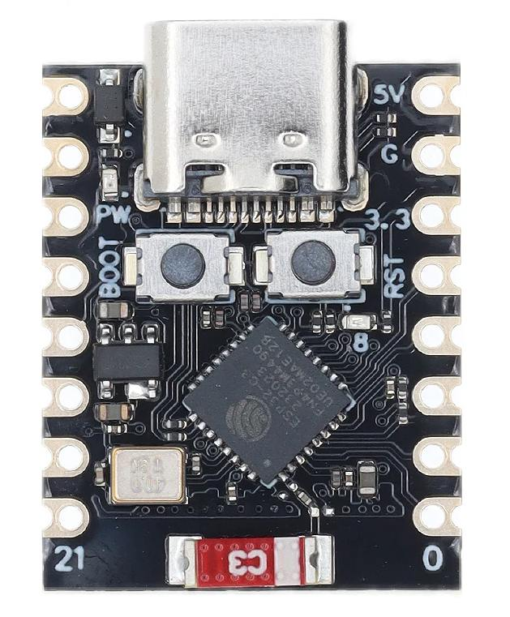

# Croaster — ESP32-C3 Super Mini Implementation

This folder is a standalone **PlatformIO** project for the **ESP32-C3 Super Mini**
board. It consumes the Croaster library from `croaster/` (`../../croaster`)
plus the shared SSD1306 display (`../common`), and wires them into the
library's display-agnostic `CroasterApp` (`src/main.cpp`).



---

## 📋 Board

- **MCU:** ESP32-C3 (RISC-V), **WiFi + BLE**
- **Display:** 128×64 SSD1306 OLED (I2C) — from `boards/common`
- **Partition scheme:** custom `custom32c3sm.csv` (in this folder) — a 1.9 MB
  app slot **with an OTA slot**, set via `board_build.partitions = custom32c3sm.csv`

---

## 🔧 Build & Upload

```bash
cd boards/esp32c3
pio run -e esp32c3 -t upload
```

> BLE is compiled in automatically — `CroasterBleManager` is only built when the
> board has BLE (`CROASTER_HAS_BLE`).

---

## 🔌 Wiring

| Component | GPIO |
|:---|:---:|
| **OLED** SCL | 9 |
| **OLED** SDA | 8 |
| **ET sensor** SCK | 4 |
| **ET sensor** SO | 5 |
| **ET sensor** CS | 6 |
| **BT sensor** SCK | 4 |
| **BT sensor** SO | 5 |
| **BT sensor** CS | 7 |

Both sensors share the **SCK** and **SO** lines (SPI bus); they are distinguished
by their individual **CS** pins. All components run on **3.3V**.

---

## ⚙️ Configuration (`src/config.h`)

| Setting | Default | Purpose |
|:---|:---|:---|
| `dummyMode` | `false` | Dummy sensor data (no real thermocouples needed) |
| `pins` | `{4, 5, 7, 6}` | Thermocouple layout: SCK=4, SO=5, CS_BT=7, CS_ET=6 |
| `ledPin` | `LED_BUILTIN` | Built-in LED pin (`-1` disables the blink command) |
| `ledOnLevel` | `LOW` | Active level of the built-in LED |

---

## ⬆️ OTA

OTA is supported over **WebSocket (WiFi)** and **BLE**. It requires the custom
`custom32c3sm` partition (set in `platformio.ini`), which reserves an OTA slot —
the default 4 MB `Huge APP`-style schemes do **not** support OTA.
