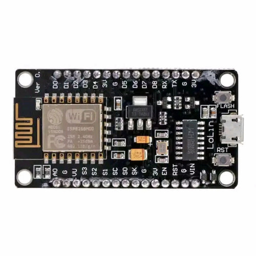

# Croaster — ESP8266 (NodeMCU / ESP-12E) Implementation

This folder is a standalone **PlatformIO** project for the **NodeMCU / ESP-12E**
board. It consumes the Croaster library from the repo root (`../..`) plus the
shared SSD1306 display (`../common`), and wires them into the library's
display-agnostic `CroasterApp` (`src/main.cpp`).



---

## 📋 Board

- **MCU:** ESP8266, **WiFi only** (no BLE)
- **Display:** 128×64 SSD1306 OLED (I2C) — from `implementation/common`
- **Partition scheme:** the default NodeMCU layout (includes an OTA slot)

---

## 🔧 Build & Upload

```bash
cd implementation/esp8266
pio run -e esp8266 -t upload
```

> BLE is not compiled on this board — `CroasterBleManager` is excluded
> automatically (`CROASTER_HAS_BLE` is 0 on ESP8266).

---

## 🔌 Wiring

| Component | NodeMCU pin |
|:---|:---:|
| **OLED** SCL | D1 |
| **OLED** SDA | D2 |
| **ET sensor** SCK | D5 |
| **ET sensor** SO | D7 |
| **ET sensor** CS | D6 |
| **BT sensor** SCK | D5 |
| **BT sensor** SO | D7 |
| **BT sensor** CS | D8 |

Both sensors share the **SCK** and **SO** lines (SPI bus); they are distinguished
by their individual **CS** pins. All components run on **3.3V**.

---

## ⚙️ Configuration (`src/config.h`)

| Setting | Default | Purpose |
|:---|:---|:---|
| `dummyMode` | `false` | Dummy sensor data (no real thermocouples needed) |
| `pins` | `{D5, D7, D8, D6}` | Thermocouple layout: SCK=D5, SO=D7, CS_BT=D8, CS_ET=D6 |
| `ledPin` | `LED_BUILTIN` | Built-in LED pin (`-1` disables the blink command) |
| `ledOnLevel` | `LOW` | Active level of the built-in LED |

---

## ⬆️ OTA

OTA is supported over **WebSocket (WiFi)** using the default NodeMCU partition
scheme (which includes an OTA slot). BLE OTA is not available on the ESP8266.
